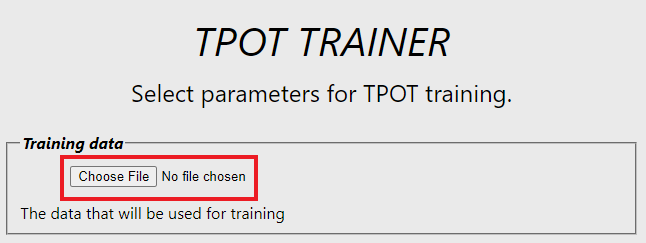
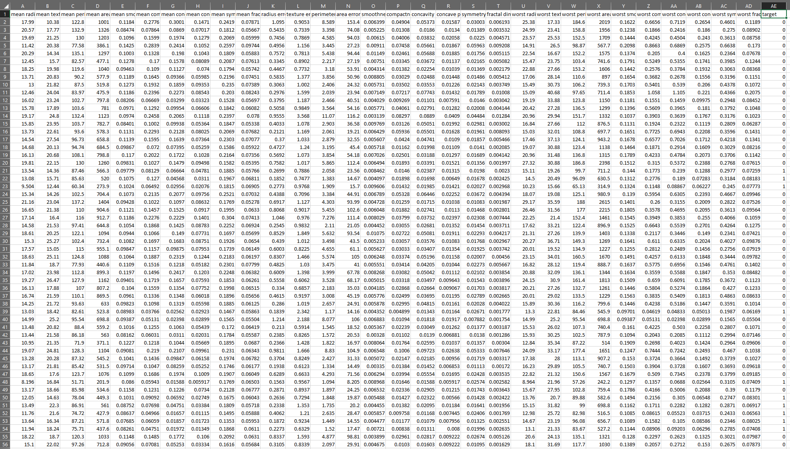
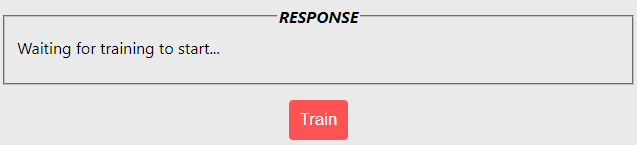
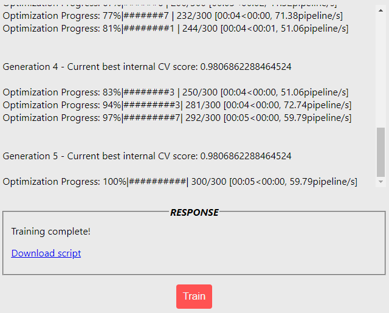

## Clone Project

Clone the project:

`git clone https://github.com/tavetisyan95/TPOT_web_app.git`


## Set the `api_url`

In the directory `app/TPOT_web_app/src/` set the root_url inside `config.js`:

```
export const config = {
    api_url : "localhost",
    api_port: 5000,
    api_endpoint : "setup-train-tpot"
}
```

NOTE: If you're using a different port for the Flask API, set it here. Don't put any http or backslashes in the api_url.


## Install Dependencies and Start Web Servers

Run the following in terminal:
`bash start.sh`

NOTE: Make sure that ports 3000, 5000, and 8080 are publicly available (otherwise you may run into CORs issues).

The app should launch in your web browser. If it doesn't, navigate to http://localhost:3000.

The app will have been fully launched once its webpage opens in the browser.


## Choose a dataset and parameters for training

To begin training the TPOT optimizer, the only thing that needs to be provided is a dataset file. Click `Choose File` and select the desired dataset.



Two test CSVs can be found in the root directory of the project - "dataset.csv" and "dataset_regression.csv". They are intended for classification and regression respectively.

The app expects datasets in a CSV file with a column header. The label column should be named "Target". Feature column names can be anything.

Note that there should be no column for indices in the CSV file. The app doesn't handle index columns. The dataset should look like this:



When using pandas, you would get the correct CSV structure by using a statement like this:

`dataset_df.to_csv("dataset.csv", index=False)`


## Start training

After a dataset is selected, scroll to the bottom of the page and click `Train`. 



Training logs should start appearing above the button area.

When training completes succesfully, you will see "Training complete!" in the **RESPONSE** area. Below, you'll additionally see the clickable **Download script** text. Click on this text to download the pipeline script generated by TPOT.




## Limitations of the app

In its current implementation, the app has some notable limitations, including:

- No error messages on the webpage if something goes wrong. The only source of information about errors is the app's terminal.
- Not all parameters of TPOT have been included in the app. More specifically`memory`, `periodic_checkpoint_folder`, and `disable_update_check` are missing.
- Users cannot set up a custom directory for logs. The log directory is defined in the API Python code.
- Some parameters - like `config_dict`, `scoring`, and `cv` - accept more complex inputs than just strings and integers. For example, TPOT's `config_dict` can take custom configuration dictionaries, while `scoring` accepts custom scoring functions. None of these complex behaviors were implemented in the app.
- The sum of `mutation_rate` and `crossover_rate` must not exceed 1.0. The app doesn't handle invalid inputs for these parameters in any way - you can pass any value between 0.0 and 1.0 for both. You'll still get errors in the terminal, but the app doesn't give any on-page warning that invalid inputs are selected.


## Starting in Docker
```docker-compose -f docker-compose.yaml up -d --build```