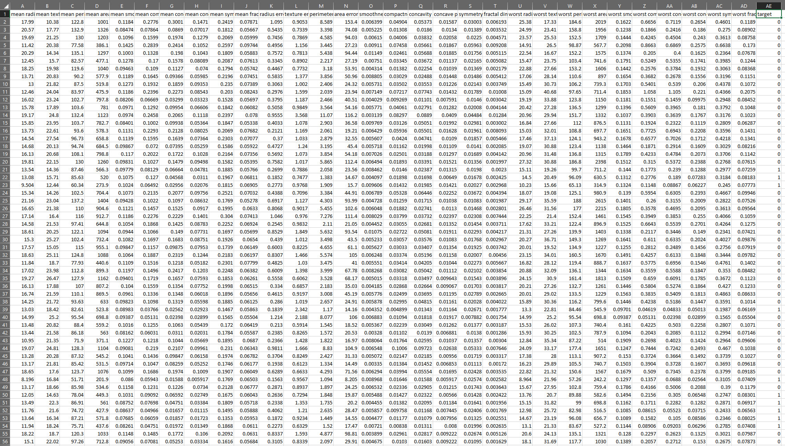

## Clone Project

Clone the project:

`git clone https://github.com/tavetisyan95/mlflow_web_app.git`


## Set the `api_url`

In the directory `app/MLflow_web_app/src/` inside `config.js`, edit the API URL, if necessary:

```
export const config = {
  api_url: "localhost",
  api_port: 5000,
  http_server_port: 8080,
  api_training_endpoint: "track-experiment",
  api_inference_endpoint: "deploy-model"
};
```

Don't put any http or backslashes in the api_url.

NOTE: If you want to use different ports for the Flask API or http-server, set them here.


## Install Dependencies and Start Web Servers

Run the following in terminal:

`bash start.sh 4000`

`4000` indicates the port that the MLflow UI will be run on. This UI is separate from our app and is a product of the MLflow team.

You may enter another port number if you wish, except for 3000, 5000, and 8080. These are used by our React app, the Flask web server, and http-server respectively.

NOTE: Make sure that ports 3000, 4000, 5000, and 8080 are publicly available and unused by other processes. If not, either free them up or use other ports.

The app and the MLflow UI should launch in your web browser. If they don't, navigate to http://localhost:3000 (for our app) and http://localhost:4000 (for the MLflow UI).

The app will have been fully launched once its webpage opens in the browser.


## Configuring the estimator

By default, the React app launches in training mode:


Before you can do inference, you need to run scikit-learn's grid search algorithm and get the best trained estimator.

To start training, you need to:

1. Select the desired estimator.
2. Select a training dataset.
3. Enter an experiment name to log the models under.
4. Select grid search parameters.
5. Select estimator hyperparameters for grid search to try.

### 1. Selecting an estimator

Our app implements two scikit-learn estimators:

- `sklearn.linear_model.LogisticRegression`.
- `sklearn.linear_model.LinearRegression`.

Use the dropdown list under `Estimator` to select the desired algorithm:


### 2. Selecting a training dataset setting grid search parameters

Click on the `UPLOAD` button to select a training dataset.


You can find two CSVs for training in the root directory of the project - `dataset_classification_training.csv` and `dataset_regression_training.csv`. They are intended for classification and regression respectively.

The app expects datasets in a CSV file with a column header. The label column should be named "Target". Feature column names can be anything.

Note that there should be no column for indices in the CSV file. The app doesn't handle index columns. The dataset should look like this:



When using pandas, you would get the correct CSV structure by using a statement like this:

`dataset_df.to_csv("dataset.csv", index=False)`

### 3. Entering an experiment name

By default, all runs are logged to an experiment named "Experiment". To keep runs organized, you can enter a name of your own choosing.


### 4. Selecting grid search parameters

Our app implements the following parameters of scikit-learn's `GridSearchCV`:

- `n_jobs`. The number of CPU cores that will be used during training. The value you enter here is passed not only to `GridSearchCV` but also to the estimator you selected.
- `cv`. The number of cross-validation folds.
- `return_train_score`. Whether or not training scores should be tracked.

The default values of these parameters work - no need to change them.

### 5. Selecting estimator hyperparameters

To tweak estimator hyperparameters, scroll down until you reach the `ESTIMATOR HYPERPARAMETERS` section. You'll see the hyperparameters for the estimator you choose on step 2.

You can tweak most of the hyperparameters implemented in `LogisticRegression` and `LinearRegression`.

Follow the instructions under each hyperparameter. For some hyperparameters, you can enter several values/select several options for grid search to try.

For testing purposes, the default hyperparameter values work - there is no need to change them.

## Training grid search

Once you are done with the previous steps, scroll back up and click `Train Grid Search`.

While training is in progress, you will see the message `Training` under `RESPONSE`. Once training is complete, you will see `Training complete!`


You should now be able to see logged runs in the MLflow UI.


## Doing inference with trained models

To do inference with the trained models, scroll to the top of the app and select `Prediction` under `Mode`. You will see something like this:


To start inferece, do the following:

1. Click the `UPLOAD` button and upload a dataset to do predictions with. You can find two test CSV datasets in the root directory of the repo - `dataset_classification_prediction.csv` and `dataset_regression_prediction.csv`
2. Enter the name of the file that predictions should be saved to. The app is intended to save predictions to CSV files, but other formats might work as well.
3. Select the experiment under which the desired model has been saved. Once you select an experiment, you will see run IDs that were logged under it.
4. Select the run ID of the desired model. 


Then, click `Deploy` - this will load the best estimator trained logged under the selected experiment and run ID. Note that if you will be re-using the same model for predictions, there's no need to re-deploy it every time before inference. But if you want to use another model, you will need to select its ID and deploy it.

Once this is done, click `Predict`. Once prediction is complete, you will see the name of the CSV file with predictions under `Saved prediction files`.


Click on the desired filename to download it to your machine.

## Terminating the app

If you terminate the app from the terminal, all saved prediction files and MLflow logs will be deleted.

## LIMITATIONS OF THE APP

In its current implementation, the app has some notable limitations, including:

- No error messages pop up on the webpage if something goes wrong. The only source of information about errors is the app's terminal.
- Invalid inputs for hyperparameters aren't handled. No error messages are shown in the web browser. The only way to know that something has gone wrong is through terminal logs.
- Not all parameters of `LogisticRegression` and `LinearRegression` have been implemented in the app.

## Starting in Docker
```docker-compose -f docker-compose.yaml up -d --build```